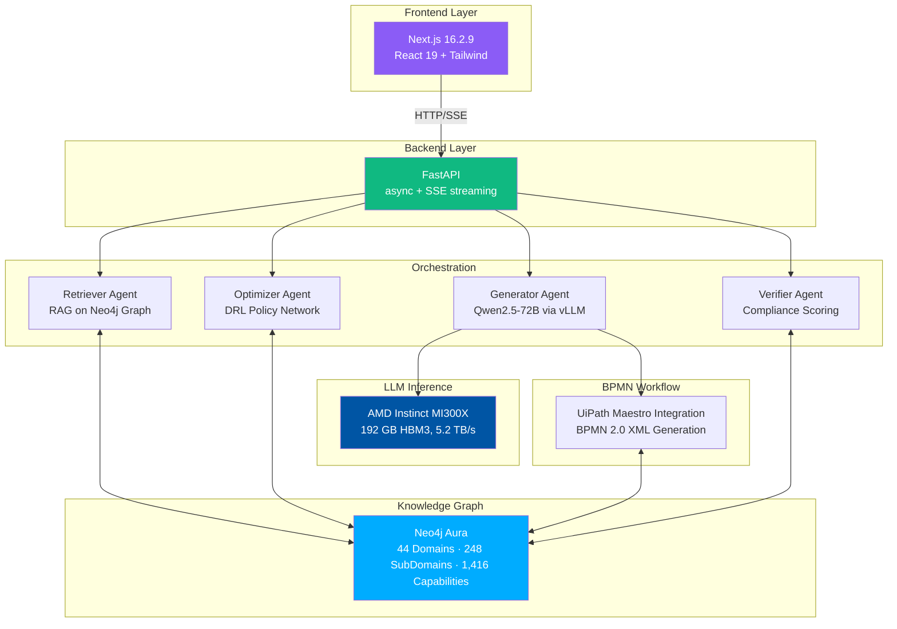
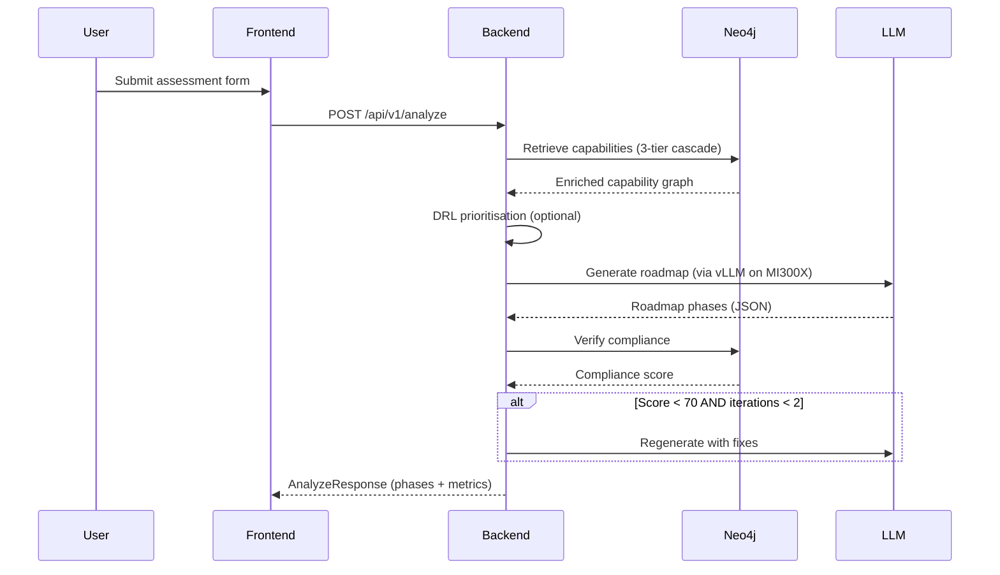
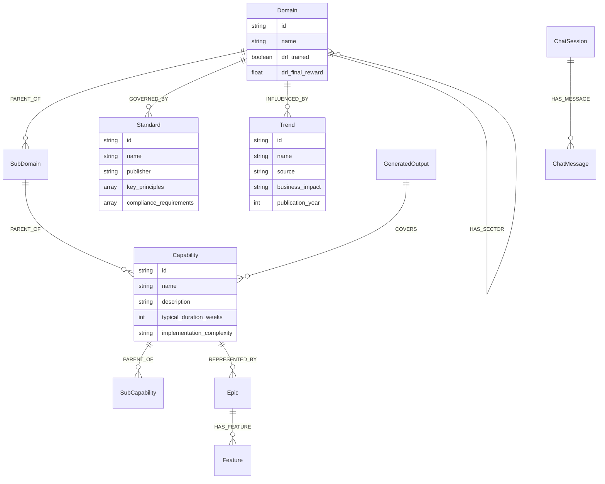

# AMD EA Strategy Optimizer

> **AMD Developer Hackathon 2026 · Track 1 — AI Agents & Agentic Workflows**

An AI-powered **Enterprise Architecture platform** that transforms business goals into governance-grounded, Jira-ready strategic roadmaps — powered by **AMD Instinct MI300X**, a 1,416-capability knowledge graph, Deep Reinforcement Learning prioritisation, and a self-correcting LangGraph agentic pipeline.

---

## Changelog (latest first)

| Date | What changed |
|------|-------------|
| 2026-05-07 | Chat session persistence (Neo4j-backed), DRL enrichment triggered per chat turn, `llm_max_tokens` fix (was hard-coded 1024) |
| 2026-05-03 | Full platform: EA Advisor, Graph Explorer, Integrations, DRL pipeline, initial docs |

---

## Platform Views

| View | Description |
|------|-------------|
| **Canvas** | Assessment intake form, domain hierarchy explorer, and interactive ENABLES network graph |
| **Assessments** | Dashboard of all past assessments with compliance scores and status |
| **BPMN Studio** | Visual BPMN 2.0 editor for roadmap workflows with export capabilities |
| **Review** | Human-in-the-loop portal for task review and approval of AI-generated roadmaps |
| **Analytics** | DRL training dashboard — coverage heatmap, reward curves, trigger training |
| **Settings** | Configure integrations and system connections |

---

## Architecture



### Request Flow



### Knowledge Graph Schema



---

### Key Design Decisions

- **3-tier retrieval cascade:** exact capability IDs → domain name expansion → semantic vector similarity
- **DRL prioritisation:** REINFORCE policy gradient, 20-dim state, 10-dim action (Gumbel-top-k sampling)
- **Output caching:** MD5(sorted capability IDs + org_type) → `:GeneratedOutput` node in Neo4j; cache hits skip the entire pipeline
- **Cross-domain synthesis:** when org type spans multiple domains (e.g. PE firm + Aviation), the `[CROSS-DOMAIN CONTEXT]` header and per-epic framing adapt the output accordingly
- **Self-correcting loop:** compliance verifier scores the roadmap; if score < 70 and iterations < 2, the generator is re-invoked with specific issues to fix
- **Chat session persistence:** every user↔assistant exchange is stored in Neo4j as `(:ChatSession)-[:HAS_MESSAGE]→(:ChatMessage)` nodes; the Conversation History panel lets users switch, reload, and delete sessions across page refreshes
- **Automatic DRL enrichment:** after each chat turn, domains retrieved from the RAG context that have not yet been DRL-trained trigger a fire-and-forget background training run (50 episodes); a toast notification confirms the trigger
- **Token budget fix:** `LLMClient` now uses `settings.llm_max_tokens` (default 4096) for both streaming and non-streaming calls; the previous hard-coded 1024 cap was causing truncated responses

---

## Tech Stack

| Layer | Technology |
|-------|-----------|
| **LLM Inference** | Qwen/Qwen2.5-72B-Instruct on **AMD Instinct MI300X** via vLLM |
| **LLM Fallback** | Groq / Gemini / OpenRouter multi-provider chain |
| **Knowledge Graph** | Neo4j Aura |
| **Embeddings** | sentence-transformers/all-MiniLM-L6-v2 |
| **Agentic Orchestration** | LangGraph StateGraph |
| **DRL Training** | PyTorch (ROCm-compatible), REINFORCE |
| **Backend** | FastAPI + async + SSE streaming |
| **Frontend** | Next.js 16.2.9 (App Router) + React 19 + TypeScript + Tailwind CSS |
| **Visualization** | vis-network (graph), react-plotly.js (charts), bpmn-js (BPMN editor) |
| **ITSM Integration** | Jira REST API v3 (live) · ServiceNow / Azure DevOps (mock) |
| **BPMN Integration** | UiPath Maestro compatible BPMN 2.0 export |

---

## Quick Start

### Prerequisites

- Python 3.11+
- Node.js 20+
- Neo4j Aura instance (free tier works — seed with `hf_space/neo4j_backup/seed_graph.cypher`)
- AMD Developer Cloud VM with vLLM serving Qwen2.5-72B-Instruct (or use fallback API)

### 1. Clone & install

```bash
git clone https://github.com/Godwin-88/redesigned-goggles.git
cd redesigned-goggles

# Backend dependencies
pip install -r requirements.backend.txt
pip install -r requirements.pipeline.txt

# Frontend dependencies
cd frontend
npm install
```

### 2. Configure environment

```bash
cp .env.example .env
# Edit .env — fill in Neo4j credentials, vLLM URL, Jira credentials
```

Key variables:

| Variable | Description |
|----------|-------------|
| `NEO4J_URI` | Neo4j Aura connection URI |
| `NEO4J_PASSWORD` | Neo4j password |
| `VLLM_BASE_URL` | AMD MI300X vLLM endpoint (e.g. `http://134.x.x.x:8000/v1`) |
| `JIRA_URL` | Jira Cloud URL (e.g. `https://yourorg.atlassian.net`) |
| `JIRA_EMAIL` | Jira account email |
| `JIRA_API_TOKEN` | Jira API token — generate at [id.atlassian.com](https://id.atlassian.com/manage-profile/security/api-tokens) |
| `JIRA_PROJECT_KEY` | Target Jira project key (e.g. `EAOPT`) |
| `GROQ_API_KEY` | Groq API key for fallback inference |
| `GEMINI_API_KEY` | Google Gemini API key for fallback inference |
| `OPENROUTER_API_KEY` | OpenRouter API key for fallback inference |

### 3. Seed the knowledge graph

```bash
# Using cypher-shell:
cypher-shell -u neo4j -p <password> -f "hf_space/neo4j_backup/seed_graph.cypher"
```

### 4. Run locally

```bash
# Terminal 1 — Backend
uvicorn backend.main:app --host 0.0.0.0 --port 8080

# Terminal 2 — Frontend
cd frontend
npm run dev
```

Open [http://localhost:3000](http://localhost:3000)

### 5. (Optional) Pre-train DRL and seed output cache

```bash
# Train all 44 domains, 50 episodes each
python -m pipeline.train_on_graph --episodes 50

# Train a specific domain
python -m pipeline.train_on_graph --domain "Healthcare Provider" --episodes 100
```

---

## Docker Deployment

```bash
docker compose up --build
```

Backend: `http://localhost:8080` · Frontend: `http://localhost:3000` · Neo4j: `bolt://localhost:7688`

---

## Jira Integration Setup

1. Log into Jira Cloud → **Account Settings → Security → API tokens → Create API token**
2. Copy the token immediately
3. Add to `.env`:
   ```
   JIRA_URL=https://yourorg.atlassian.net
   JIRA_EMAIL=you@yourorg.com
   JIRA_API_TOKEN=<your-token>
   JIRA_PROJECT_KEY=EAOPT
   ```
4. In the platform: **Settings → Jira Integration**
5. Generate a roadmap, then click **Export Roadmap to Jira**

The exporter creates one **Epic** per strategic initiative and one **Story** per feature workstream, with governance-grounded acceptance criteria carried through to Jira.

---

## API Reference

All endpoints are prefixed with `/api/v1/` and documented interactively at `http://localhost:8080/docs`.

### Core Endpoints

| Endpoint | Method | Description |
|----------|--------|-------------|
| `/health` | GET | Backend + Neo4j + GPU health status |
| `/analyze` | POST | Full agentic pipeline execution |
| `/domains` | GET | All 44 strategic domains |
| `/capabilities` | GET | Capabilities filtered by domain |
| `/subdomains` | GET | SubDomains filtered by domain names |
| `/subdomain-capabilities` | GET | Capabilities filtered by subdomain IDs |
| `/stats` | GET | Graph node counts |
| `/assessments` | GET | List recent assessments |

### Chat & Sessions

| Endpoint | Method | Description |
|----------|--------|-------------|
| `/chat` | POST | Non-streaming RAG chat (persists to session) |
| `/chat/stream` | GET | SSE streaming RAG chat (persists to session) |
| `/chat/sessions` | POST | Create or touch a chat session |
| `/chat/sessions` | GET | List 15 most recent sessions |
| `/chat/sessions/{id}/messages` | GET | Full message history for a session |
| `/chat/sessions/{id}` | DELETE | Delete a session and all its messages |

### Graph Endpoints

| Endpoint | Method | Description |
|----------|--------|-------------|
| `/graph/network` | GET | `{nodes, edges}` for Graph Explorer visualization |
| `/graph/enables` | GET | ENABLES relationships between domains |
| `/graph/domain-detail` | GET | Full capability hierarchy for a domain |
| `/graph/query` | POST | Natural language to Cypher translation |

### Integrations

| Endpoint | Method | Description |
|----------|--------|-------------|
| `/integrations/jira/export` | POST | Live Jira Epic/Story creation |
| `/integrations/itsm/connect` | POST | ServiceNow / Azure DevOps mock connection |
| `/integrations/erp/ingest` | POST | CSV → Neo4j ExternalSystem nodes |
| `/integrations/archimate` | GET | Capabilities by ArchiMate layer |
| `/integrations/bpmn/generate` | POST | Generate BPMN XML from roadmap phases |
| `/integrations/bpmn/generate-from-assessment` | POST | Generate BPMN for stored assessment |
| `/integrations/bpmn/models` | GET | List saved BPMN models |
| `/integrations/bpmn/models` | POST | Create BPMN model |
| `/integrations/bpmn/models/{id}` | PUT | Update BPMN model |
| `/integrations/bpmn/models/{id}` | DELETE | Delete BPMN model |

### Training & Analytics

| Endpoint | Method | Description |
|----------|--------|-------------|
| `/training/run` | POST | Trigger DRL training run |
| `/training/metrics` | GET | Training run history and rewards |
| `/training/coverage` | GET | DRL enrichment coverage by domain |
| `/training/status/{run_id}` | GET | Check training task status |

### UiPath Integration

| Endpoint | Method | Description |
|----------|--------|-------------|
| `/uipath/tasks` | GET | List human tasks for review |
| `/uipath/processes` | GET | List generated outputs |
| `/uipath/assessment/{id}` | GET | Get assessment results |
| `/uipath/task-complete` | POST | Complete human task with decision |
| `/uipath/generate-report` | POST | Generate full assessment report |

---

## Project Structure

```
├── backend/
│   ├── api/
│   │   ├── routes_health.py      # /health endpoint
│   │   ├── routes_graph.py       # Domain, capability, graph queries
│   │   ├── routes_analyze.py     # Main /analyze endpoint
│   │   ├── routes_training.py    # DRL training control
│   │   ├── routes_chat.py        # Chat + session management
│   │   ├── routes_integrations.py # Jira, ERP, ArchiMate, ITSM
│   │   ├── routes_uipath.py      # UiPath Maestro integration
│   │   ├── routes_bpmn.py        # BPMN generation endpoints
│   │   └── __init__.py
│   ├── agents/
│   │   ├── orchestrator.py       # LangGraph StateGraph pipeline
│   │   ├── retriever.py          # Graph RAG retrieval
│   │   ├── optimizer.py          # DRL prioritization
│   │   ├── generator.py          # LLM roadmap generation
│   │   ├── verifier.py           # Compliance scoring
│   │   └── __init__.py
│   ├── drl/
│   │   ├── trainer.py            # REINFORCE trainer
│   │   ├── policy_network.py     # MLP policy network
│   │   ├── environment.py        # DRL environment base
│   │   ├── graph_environment.py  # Neo4j-backed environment
│   │   └── __init__.py
│   ├── graph/
│   │   ├── neo4j_client.py       # Neo4j connection wrapper
│   │   ├── cypher_queries.py     # All Cypher queries
│   │   └── __init__.py
│   ├── llm/
│   │   ├── client.py             # Multi-provider LLM client
│   │   ├── prompts.py            # System prompts
│   │   └── __init__.py
│   ├── schemas/
│   │   ├── request.py            # AnalyzeRequest model
│   │   └── response.py           # AnalyzeResponse, AMDMetrics, etc.
│   ├── config.py                 # Pydantic settings
│   └── dependencies.py           # DI container
├── frontend/
│   ├── app/
│   │   ├── layout.tsx
│   │   ├── page.tsx              # Main canvas view
│   │   ├── assessments/page.tsx    # Assessment history
│   │   ├── analytics/page.tsx    # Analytics dashboard
│   │   ├── review/page.tsx       # Human task portal
│   │   ├── canvas/page.tsx       # Alternative canvas view
│   │   └── bpmn-studio/page.tsx  # BPMN editor
│   ├── components/
│   │   ├── sidebar-nav.tsx       # Navigation sidebar
│   │   ├── input-form.tsx        # Assessment intake form
│   │   ├── roadmap-tab.tsx       # Roadmap display
│   │   ├── graph-explorer-tab.tsx
│   │   ├── training-tab.tsx      # DRL metrics dashboard
│   │   ├── epics-tab.tsx         # Epic / feature view
│   │   ├── export-tab.tsx        # Export controls
│   │   ├── chat-tab.tsx          # EA advisor chat
│   │   ├── integrations-tab.tsx    # Integration config
│   │   ├── enables-network-graph.tsx # vis-network graph
│   │   └── bpmn-modeler.tsx      # bpmn-js editor component
│   ├── lib/
│   │   └── context.tsx           # React context (zustand)
│   ├── types/
│   │   └── bpmn-js.d.ts          # TypeScript declarations
│   ├── package.json
│   └── next.config.ts
├── pipeline/
│   ├── train_on_graph.py         # Full-graph DRL training
│   ├── seed_graph_cache.py       # Pre-training + cache seeding
│   ├── enrich_graph_v2.py        # Graph enrichment
│   ├── embed_nodes.py            # Embedding generation
│   └── knowledge_sources/
│       ├── standards_catalog.py
│       ├── trends_catalog.py
│       └── capability_enrichments.py
├── hf_space/
│   ├── neo4j_backup/
│   │   └── seed_graph.cypher     # Knowledge graph seed data
│   ├── Dockerfile
│   ├── entrypoint.sh
│   └── supervisord.conf
├── docs/
│   └── PLATFORM_GUIDE.md         # Full platform guide
├── docker-compose.yml
├── Dockerfile.backend
├── Dockerfile.frontend
├── .env.example
└── requirements.*.txt
```

---

## Development Commands

### Backend (from root)

```bash
uvicorn backend.main:app --host 0.0.0.0 --port 8080
```

### Frontend (from frontend/)

```bash
npm run dev      # Development server on :3000
npm run build    # Production build
npm run start    # Serve production build
npm run lint     # ESLint
```

### Docker (from root)

```bash
docker compose up --build    # Start all services
docker compose down          # Stop services
docker compose ps            # Check status
```

---

## AMD Technology Story

### AMD Instinct MI300X

LLM inference runs on AMD Instinct MI300X — 192 GB HBM3, 5.2 TB/s memory bandwidth — the only single GPU with enough unified memory to serve Qwen2.5-72B at fp16 without sharding. vLLM continuous batching maximises throughput; SSE streaming delivers first-token latency of ~1–2 seconds.

### ROCm + PyTorch DRL

The DRL policy network is ROCm-compatible. `get_device()` in `backend/drl/policy_network.py` detects ROCm via `torch.version.hip` and returns `cuda:0` on ROCm systems. On CPU-only machines (local dev), it logs a clear message pointing to the remote AMD MI300X for LLM inference.

---

## License

MIT