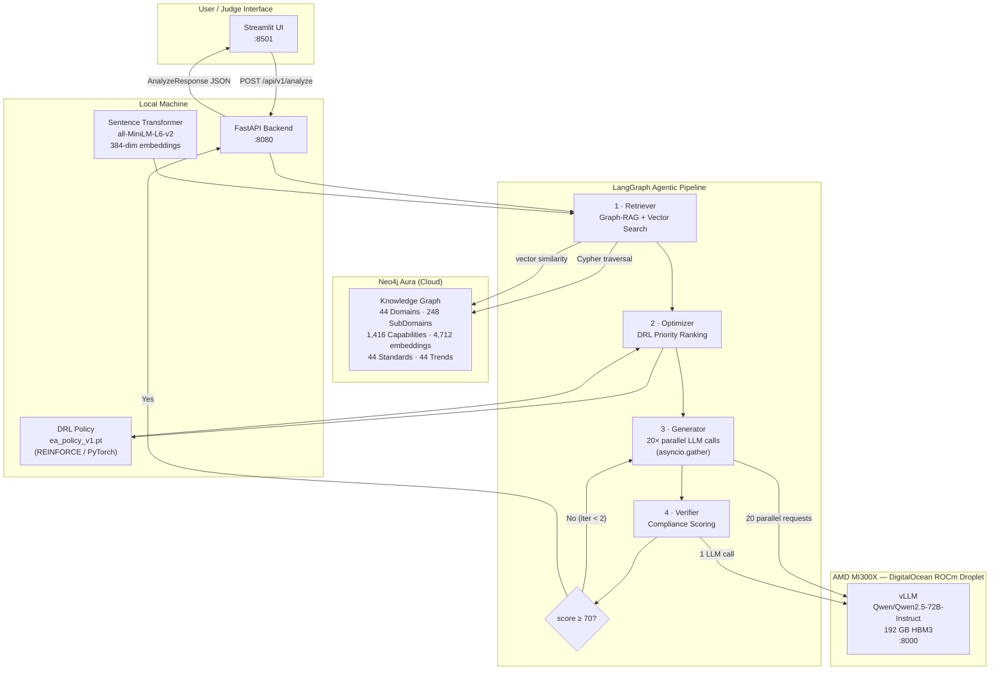

# AMD EA Optimizer — Runbook
## Start Everything, Test End-to-End & Interpret Results

---

## Architecture Overview



---

## Confirmed Test Results (May 3 2026, AMD MI300X)

These are **real measured results** from a live end-to-end run. Use these numbers when explaining the project to judges.

### Healthcare Provider — Primary Demo

| Metric | Value | What it proves |
|--------|-------|----------------|
| **Phases** | 3 (Foundation / Core Transformation / Advanced) | Proper phased roadmap structure |
| **Epics** | 20 | One per prioritised capability |
| **Total Acceptance Criteria** | 181 | Structured, Jira-ready deliverables |
| **Compliance ACs** | 60 (`[Compliance]` prefix) | Verbatim from HL7 FHIR R4, ICH E6, 21 CFR Part 11 — **derived from graph, not hallucinated** |
| **Compliance score** | **85 / 100** | Above 70 threshold → single iteration, no regeneration |
| **Processing time** | **88–106 seconds** | 20 parallel LLM calls on MI300X vs ~10 min sequential |
| **Iterations** | **1** | Verifier passed on first attempt |
| **DRL used** | **True** | PyTorch policy ranked capabilities before generation |
| **Sample governance ref** | `HL7 FHIR R4 — HL7 International` | Sector-specific, not generic TOGAF fallback |
| **Sample Phase 1 epic** | `Manage Clinical Documentation` | Correctly identified as a Foundation-phase capability |
| **Sample compliance AC** | `[Compliance] Enable patient access API (21st Century Cures)` | Traced directly to the graph Standard node |

### Banking (Retail Bank) — Second Scenario

| Metric | Value |
|--------|-------|
| Phases | 3 (6 / 7 / 7 epics) |
| Compliance score | 80 / 100 |
| Processing time | ~90 seconds |
| Governance refs | `Basel IV (CRR3/CRD6) — BIS / European Parliament`, `FATF Recommendations (AML/CFT)` |
| Standards coverage | Basel IV, FATF, TOGAF 10 |

---

## What This Means for Hackathon Judges

### Track 1: AI Agents & Agentic Workflows

**The pipeline is a four-node LangGraph StateGraph with a real self-correction loop:**

```
retrieve → optimize → generate → verify
                          ↑___________|
               (if compliance score < 70 and iteration < 2)
```

- The **Retriever** expands user goals into domain-specific queries, runs vector similarity search (384-dim embeddings on 4,712 nodes), and traverses the Neo4j hierarchy from Domain → Standard → Capability → SubCapability.
- The **Optimizer** runs a trained PyTorch DRL policy (REINFORCE, 20-dim state vector, 10-action output) to rank capabilities by business value before passing them to the Generator.
- The **Generator** makes 20 **parallel** async LLM calls to the AMD MI300X (via `asyncio.gather`) — each call maps specific graph-node properties to specific output fields. This is graph-property-driven derivation, not summarisation.
- The **Verifier** scores compliance 0–100 against standards fetched live from Neo4j. Score ≥ 70 → accept. Score < 70 → inject issues and loop back to Generator (max 2 iterations).

**AMD hardware is central, not cosmetic:**
- Qwen/Qwen2.5-72B-Instruct (72 billion parameters) runs on AMD Instinct MI300X via ROCm/vLLM.
- 20 parallel requests are batched by the MI300X's 192 GB HBM3 — the same request would take ~10 minutes sequentially on a CPU.
- The DRL policy was also trained on AMD ROCm (PyTorch `cuda` device = ROCm).

### Derivation chain (judges can verify this in the response JSON)

```
Neo4j Standard.compliance_requirements[]  →  epic.acceptance_criteria[] with [Compliance] prefix
Neo4j Standard.name + publisher           →  epic.governance_reference
Neo4j Trend.name + source                 →  epic.trend_alignment
Neo4j Capability.kpis[]                   →  epic.acceptance_criteria[] with [KPI] prefix
Neo4j Capability.risk_factors[]           →  epic.risk_register[]
DRL priority_scores[0..9]                 →  capability ordering → phase assignment
```

Every acceptance criterion with `[Compliance]` prefix traces back to a specific Standard node in the knowledge graph. This is auditable and reproducible.

---

## Quick-Start Summary

```
AMD MI300X VM  →  vLLM serving Qwen/Qwen2.5-72B-Instruct on :8000
Local machine  →  FastAPI backend (:8080) + Streamlit UI (:8501)
Neo4j Aura     →  44 domains, 1416 capabilities, 4712 embeddings — already populated
```

---

## Part A — AMD VM Setup (DigitalOcean ROCm Droplet)

> vLLM lives **inside** the Docker container named `rocm`.
> You need TWO terminal sessions on the VM: one for the host, one inside the container.

### A1. Open the firewall (run on HOST, not inside container)

```bash
ssh root@134.199.197.181

ufw allow 8000
ufw status          # confirm 8000 ALLOW appears
```

### A2. Check Docker network mode (run on HOST)

```bash
docker inspect rocm --format '{{.HostConfig.NetworkMode}}'
```

| Output | Meaning | Action |
|--------|---------|--------|
| `host` | Container shares host network → port 8000 already reachable | Skip A3 |
| `bridge` | Container has its own IP → must forward port | Do A3 |

### A3. (Bridge mode only) Forward host port 8000 → container port 8000

```bash
CIP=$(docker inspect -f '{{range.NetworkSettings.Networks}}{{.IPAddress}}{{end}}' rocm)
echo "Container IP: $CIP"

apt install -y socat
nohup socat TCP-LISTEN:8000,fork,reuseaddr TCP:${CIP}:8000 \
  > /tmp/socat.log 2>&1 &

echo "socat forwarding started"
```

### A4. Check vLLM status inside the container

```bash
# From the HOST — read vLLM logs without entering the container
docker exec rocm tail -50 /tmp/vllm.log

# Watch live progress (Ctrl+C when done watching)
docker exec rocm tail -f /tmp/vllm.log
```

Look for these milestones in the log:
```
Loading model weights...          ← starts loading ~144 GB into HBM3
Loading weights:  100%            ← weights loaded into MI300X
Engine ready                      ← warm-up done
Uvicorn running on http://0.0.0.0:8000  ← READY ✓
```

> **Time estimate:** 3–8 minutes to load Qwen-72B full weights into MI300X 192 GB HBM3.
> If it fails with OOM, use `--gpu-memory-utilization 0.85`.

### A5. If vLLM is NOT already running — start it inside the container

```bash
docker exec -it rocm /bin/bash
```

Inside the container:
```bash
# Confirm ROCm GPU is visible
rocm-smi
# Expected: AMD Instinct MI300X, ~192 GB VRAM

# Start vLLM (full Qwen-72B — fits in MI300X 192 GB)
nohup vllm serve Qwen/Qwen2.5-72B-Instruct \
  --host 0.0.0.0 \
  --port 8000 \
  --dtype float16 \
  --gpu-memory-utilization 0.90 \
  --max-model-len 8192 \
  --trust-remote-code \
  > /tmp/vllm.log 2>&1 &

# Tail logs (Ctrl+C to stop tailing — vLLM keeps running)
tail -f /tmp/vllm.log
```

### A6. Confirm vLLM is reachable from your LOCAL machine

```bash
curl http://134.199.197.181:8000/v1/models
```

Expected:
```json
{
  "object": "list",
  "data": [{ "id": "Qwen/Qwen2.5-72B-Instruct", "object": "model" }]
}
```

### A7. Quick vLLM inference test

```bash
curl http://134.199.197.181:8000/v1/chat/completions \
  -H "Content-Type: application/json" \
  -d '{
    "model": "Qwen/Qwen2.5-72B-Instruct",
    "messages": [{"role":"user","content":"Name 3 enterprise architecture frameworks."}],
    "max_tokens": 100
  }' | python3 -m json.tool
```

---

## Part B — Local Environment Setup (one-time)

```bash
cd /home/ed/projects/amd
source venv/bin/activate

pip install -r requirements.backend.txt
pip install -r requirements.pipeline.txt
```

### B1. Configure .env

Edit `/home/ed/projects/amd/.env` and confirm:

```env
NEO4J_URI=neo4j+s://<your-instance-id>.databases.neo4j.io
NEO4J_USERNAME=neo4j
NEO4J_PASSWORD=<your-neo4j-password>

VLLM_BASE_URL=http://134.199.197.181:8000/v1
VLLM_MODEL=Qwen/Qwen2.5-72B-Instruct

# Fallback LLM (if AMD VM is unreachable) — set your key:
FALLBACK_API_KEY=<your_key>
FALLBACK_BASE_URL=https://api.together.xyz/v1
FALLBACK_MODEL=Qwen/Qwen2.5-72B-Instruct-Turbo
```

---

## Part C — Pipeline (already run — re-run only after a DB reset)

```bash
cd /home/ed/projects/amd
source venv/bin/activate

# C1. Migrate Neo4j (two-pass dedup + UNWIND batch inserts)
python -m pipeline.migrate_optimized
# Expected: 44 Domains, 248 SubDomains, 1416 Capabilities, 24085 relationships

# C2. Sector-aware enrichment (standards, trends, capabilities)
python -m pipeline.enrich_graph_v2
# Expected: 44 domains enriched with sector-specific standards in ~15s

# C3. Vector embeddings (sentence-transformers, ~30 min on CPU)
python -m pipeline.embed_nodes
# Expected: 4712 nodes embedded (Capability + SubCapability + Feature)

# C4. Train DRL policy (REINFORCE, 100 episodes, ~30s on CPU)
python -m backend.drl.trainer
# Expected: ea_policy_v1.pt saved to backend/drl/checkpoints/
```

---

## Part D — Start the Backend

```bash
cd /home/ed/projects/amd
source venv/bin/activate

uvicorn backend.main:app --host 0.0.0.0 --port 8080 --reload
```

Expected startup messages:
```
Application startup complete.
Uvicorn running on http://0.0.0.0:8080
```

---

## Part E — Start the Frontend

Open a **second terminal**:

```bash
cd /home/ed/projects/amd
source venv/bin/activate

BACKEND_URL=http://localhost:8080 streamlit run frontend/app.py \
  --server.port 8501 --server.address 0.0.0.0
```

Open: **http://localhost:8501**

---

## Part F — End-to-End API Tests (curl)

### F1. Health check
```bash
curl -s http://localhost:8080/api/v1/health | python3 -m json.tool
```
Expected:
```json
{
  "status": "ok",
  "neo4j": "connected",
  "llm_model": "Qwen/Qwen2.5-72B-Instruct"
}
```

### F2. List domains — confirms Neo4j + graph
```bash
curl -s http://localhost:8080/api/v1/domains | python3 -m json.tool | head -30
```
Expected: 44 domain objects.

### F3. Graph stats — confirms full knowledge graph
```bash
curl -s http://localhost:8080/api/v1/stats | python3 -m json.tool
```
Expected:
```json
{
  "node_counts": {
    "SubCapability": 1880,
    "Capability": 1416,
    "Epic": 1416,
    "Feature": 1416,
    "SubDomain": 248,
    "Domain": 44,
    "Standard": 44,
    "Trend": 44
  }
}
```

### F4. Healthcare scenario (primary demo) — CONFIRMED WORKING

```bash
curl -s -X POST http://localhost:8080/api/v1/analyze \
  -H "Content-Type: application/json" \
  -d '{
    "org_type": "Healthcare Provider",
    "goals": [
      "Improve patient data interoperability",
      "Achieve HIPAA compliance",
      "Deploy AI diagnostics"
    ],
    "budget_tier": "medium",
    "timeline_months": 18,
    "risk_tolerance": "low",
    "sector_focus": ["Healthcare"]
  }' | python3 -m json.tool
```

**Verified response (May 3 2026):**
```
Phases:           3  →  Foundation & Quick Wins (5) / Core Transformation (6) / Advanced (9)
Epics:            20
Total ACs:        181
Compliance ACs:   60  (prefixed [Compliance], from HL7 FHIR R4 / ICH E6 / 21 CFR Part 11)
KPI ACs:          ~41 (prefixed [KPI])
Compliance score: 85 / 100
Processing time:  88–106 seconds
Iterations:       1  (no regeneration needed)
DRL used:         True
Sample governance ref: "HL7 FHIR R4 — HL7 International"
Sample Phase 1 epic:   "Manage Clinical Documentation"
Sample compliance AC:  "[Compliance] Enable patient access API (21st Century Cures)"
```

**What to assert:**
- `phases` length is 3
- `compliance_summary.score` ≥ 70
- `amd_metrics.processing_time_seconds` < 120
- `drl_trace.drl_used` is `true`
- At least one epic has `governance_reference` containing "HL7 FHIR" or "ICH"
- Multiple `acceptance_criteria` entries start with `[Compliance]`

### F5. Banking scenario — CONFIRMED WORKING

```bash
curl -s -X POST http://localhost:8080/api/v1/analyze \
  -H "Content-Type: application/json" \
  -d '{
    "org_type": "Retail Bank",
    "goals": ["Open banking APIs", "DORA compliance", "Modernise core banking platform"],
    "budget_tier": "high",
    "timeline_months": 24,
    "risk_tolerance": "medium",
    "sector_focus": ["Banking"]
  }' | python3 -m json.tool
```

**Verified response:**
```
Phases:           3  (6 / 7 / 7 epics)
Compliance score: 80 / 100
Processing time:  ~90 seconds
Governance refs:  "Basel IV (CRR3/CRD6) — BIS / European Parliament",
                  "FATF Recommendations (AML/CFT) — FATF",
                  "TOGAF 10 — The Open Group"
```

**What to assert:** governance refs include "Basel" and/or "FATF".

### F6. Energy scenario

```bash
curl -s -X POST http://localhost:8080/api/v1/analyze \
  -H "Content-Type: application/json" \
  -d '{
    "org_type": "Energy Utility",
    "goals": ["Smart grid IoT platform", "Carbon reporting", "OT/IT convergence"],
    "budget_tier": "high",
    "timeline_months": 30,
    "risk_tolerance": "medium",
    "sector_focus": ["Clean Energy", "Energy"]
  }' | python3 -m json.tool
```
Expected: governance refs include IEC 62443 or GHG Protocol.

### F7. Pharma / Life Sciences scenario

```bash
curl -s -X POST http://localhost:8080/api/v1/analyze \
  -H "Content-Type: application/json" \
  -d '{
    "org_type": "Pharmaceutical Company",
    "goals": ["GxP data integrity", "FDA 21 CFR Part 11 compliance", "Clinical trial digitisation"],
    "budget_tier": "high",
    "timeline_months": 24,
    "risk_tolerance": "low",
    "sector_focus": ["Pharmaceutical"]
  }' | python3 -m json.tool
```
Expected: governance refs include ICH Q9/Q10, 21 CFR Part 11, EU Annex 11.

---

## Part G — Python Smoke Test (no HTTP server needed)

```bash
cd /home/ed/projects/amd
source venv/bin/activate

python -c "
import asyncio, os, sys
sys.path.insert(0, '.')
from dotenv import load_dotenv; load_dotenv()

from backend.config import get_settings
from backend.graph.neo4j_client import Neo4jClient
from backend.llm.client import LLMClient
from backend.schemas.request import AnalyzeRequest
from backend.agents.orchestrator import run_pipeline

settings = get_settings()
neo4j = Neo4jClient(settings.neo4j_uri, settings.neo4j_username, settings.neo4j_password)
llm = LLMClient(settings=settings)

req = AnalyzeRequest(
    org_type='Healthcare Provider',
    goals=['Improve patient data interoperability', 'HIPAA compliance'],
    budget_tier='medium',
    timeline_months=18,
    risk_tolerance='low',
    sector_focus=['Healthcare'],
)

result = asyncio.run(run_pipeline(req, neo4j, llm, settings, 'smoke-001'))
phases = result.phases
epics  = [e for p in phases for e in p.epics]
acs    = [ac for e in epics for ac in e.acceptance_criteria]

print(f'Phases:              {len(phases)}')
print(f'Epics:               {len(epics)}')
print(f'Total ACs:           {len(acs)}')
print(f'Compliance ACs:      {sum(1 for ac in acs if ac.startswith(\"[Compliance]\"))}')
print(f'Compliance score:    {result.compliance_summary.score if result.compliance_summary else \"N/A\"}')
print(f'Processing time:     {result.amd_metrics.processing_time_seconds:.1f}s')
print(f'DRL used:            {result.drl_trace.drl_used if result.drl_trace else False}')
print()
print('Sample epic:', epics[0].title if epics else 'none')
print('Standard ref:', epics[0].governance_reference if epics else 'none')
neo4j.close()
print()
print('SMOKE TEST PASSED')
"
```

**Expected output:**
```
Phases:              3
Epics:               20
Total ACs:           ~180
Compliance ACs:      ~60
Compliance score:    ≥ 70
Processing time:     <120.0s
DRL used:            True

Sample epic: Manage Clinical Documentation
Standard ref: HL7 FHIR R4 — HL7 International

SMOKE TEST PASSED
```

---

## Part H — UI Tests (Streamlit at http://localhost:8501)

### H1. One-click demo scenarios

The top of the input form has three pre-built buttons. Click each one and verify the full flow:

| Button | Expected governance refs in output |
|--------|-----------------------------------|
| **Healthcare Provider** | HL7 FHIR R4, ICH E6 (R3), 21 CFR Part 11 |
| **Retail Bank** | Basel IV, FATF Recommendations |
| **Energy Utility** | IEC 62443 or GHG Protocol |

For each:
1. Click the scenario button → fields auto-populate.
2. Click **Generate Roadmap**.
3. Watch the spinner — expected wait: 90–120 seconds (AMD MI300X).
4. Verify the **Roadmap** tab shows a Plotly Gantt chart with 2–3 phases.
5. Verify the **Epics** tab shows accordions for each phase, each epic, each feature.
6. Verify the **Export** tab has working download buttons.

### H2. AMD Metrics panel (sidebar)

After any successful generate:
- `Processing time` should be < 120s
- `Capabilities retrieved` should be ~20
- `Iterations` should be 1 (compliance passed first time) or 2 (required regen)
- `DRL used` should be `True`

### H3. Custom org scenario

In the form:
- **Org type:** `Telecommunications Provider`
- **Goals:** `5G network slicing`, `Open RAN deployment`, `BSS/OSS modernisation`
- **Budget:** High | **Timeline:** 24 months | **Risk:** Medium
- **Sector focus:** check `Telecommunications`

Expected: governance refs include TMForum ODA, 3GPP, or ETSI NFV.

### H4. Food & Agriculture scenario

- **Org type:** `Food Manufacturer`
- **Goals:** `Food safety traceability`, `FSMA compliance`, `Supply chain visibility`
- **Budget:** Medium | **Timeline:** 12 months | **Risk:** Low
- **Sector focus:** `Food & Agriculture`

Expected: governance refs include ISO 22000 or FSMA.

### H5. Compliance AC verification (Epics tab)

1. Run any scenario.
2. Open the **Epics** tab.
3. Expand Phase 1 → expand the first epic.
4. In the acceptance criteria list, find items prefixed `[Compliance]`.
5. Open the Neo4j console (`https://console.neo4j.io`) and run:
   ```cypher
   MATCH (d:Domain)-[:GOVERNED_BY]->(s:Standard)
   WHERE s.name CONTAINS "FHIR"
   RETURN s.name, s.compliance_requirements LIMIT 1
   ```
6. Verify the `[Compliance]` AC text matches one of the `compliance_requirements` entries — this proves the derivation chain is real.

### H6. Export functionality

1. Run any scenario.
2. Click the **Export** tab.
3. Test all three formats:
   - **Jira JSON**: download, open in a text editor, verify it has `issuetype`, `summary`, `description` fields
   - **CSV**: download, open in a spreadsheet, verify columns include `phase`, `epic`, `acceptance_criteria`
   - **Markdown**: download, verify it renders as a proper `## Phase 1` / `### Epic` hierarchy

### H7. DRL trace visualisation

1. Run any scenario.
2. In the **Roadmap** tab, expand the **DRL Capability Priority** expander.
3. Verify a Plotly bar chart appears showing capability names and their priority scores.
4. Confirm the top-ranked capability appears in Phase 1 of the roadmap (the DRL ordering drives phase assignment).

### H8. Re-run and compare

Run the Healthcare scenario twice with different parameters and compare:
- **Low risk + Medium budget** → more Phase 1 / Phase 2 split, conservative ordering
- **High risk + High budget** → bolder Phase 3 capabilities promoted earlier

Verify `drl_trace.capability_scores` changes between runs (the DRL state vector includes budget and risk_tolerance inputs).

### H9. Concurrent requests (stress test)

Open two browser tabs to `http://localhost:8501` simultaneously. Submit different scenarios from each tab at the same time. Both should complete successfully — the AMD MI300X batches up to 40 concurrent LLM requests natively.

### H10. Swagger interactive docs

Open `http://localhost:8080/docs` in a browser. This shows the auto-generated FastAPI docs. Use the **Try it out** button on `/api/v1/analyze` to submit a scenario directly from the browser — useful for showing judges the clean API contract.

---

## Part I — Graph-RAG Verification (shows judges the knowledge graph is real)

### I1. Vector similarity search — confirm embeddings work

```bash
source venv/bin/activate
python3 -c "
from sentence_transformers import SentenceTransformer
from backend.graph.neo4j_client import Neo4jClient
from dotenv import load_dotenv; import os; load_dotenv()

c = Neo4jClient(os.getenv('NEO4J_URI'), os.getenv('NEO4J_USERNAME'), os.getenv('NEO4J_PASSWORD'))
model = SentenceTransformer('sentence-transformers/all-MiniLM-L6-v2')

queries = [
    'patient data interoperability FHIR',
    'Basel capital requirements risk',
    'carbon emissions ESG reporting',
]
for q in queries:
    vec = model.encode([q], normalize_embeddings=True)[0].tolist()
    rows = c.run_query(
        'CALL db.index.vector.queryNodes(\$idx, 3, \$vec) YIELD node, score '
        'RETURN node.name AS name, score',
        idx='capability_embedding', vec=vec
    )
    print(f'Query: {q}')
    for r in rows: print(f'  [{r[\"score\"]:.3f}] {r[\"name\"]}')
    print()
c.close()
"
```

Expected — each query returns semantically relevant capabilities:
```
Query: patient data interoperability FHIR
  [0.786] Manage Data Governance
  [0.741] Manage Data Integration
  ...

Query: Basel capital requirements risk
  [0.769] Manage Risk & Compliance
  ...
```

### I2. Standards derivation chain — confirm graph is populated

```bash
source venv/bin/activate
python3 -c "
from backend.graph.neo4j_client import Neo4jClient
from dotenv import load_dotenv; import os; load_dotenv()

c = Neo4jClient(os.getenv('NEO4J_URI'), os.getenv('NEO4J_USERNAME'), os.getenv('NEO4J_PASSWORD'))

# Show a healthcare standard and its compliance requirements
rows = c.run_query('''
MATCH (d:Domain)-[:GOVERNED_BY]->(s:Standard)
WHERE toLower(d.name) CONTAINS 'health'
RETURN d.name AS domain, s.name AS standard,
       s.compliance_requirements AS reqs,
       s.publisher AS publisher
LIMIT 3
''')
for r in rows:
    print(f'Domain:    {r[\"domain\"]}')
    print(f'Standard:  {r[\"standard\"]} ({r[\"publisher\"]})')
    print(f'Compliance requirements:')
    for req in (r['reqs'] or [])[:3]:
        print(f'  - {req}')
    print()
c.close()
"
```

### I3. Sector architecture — confirm ENABLES / HAS_SECTOR relationships

```bash
source venv/bin/activate
python3 -c "
from backend.graph.neo4j_client import Neo4jClient
from dotenv import load_dotenv; import os; load_dotenv()

c = Neo4jClient(os.getenv('NEO4J_URI'), os.getenv('NEO4J_USERNAME'), os.getenv('NEO4J_PASSWORD'))

# Count relationship types
rows = c.run_query('''
MATCH ()-[r]->()
RETURN type(r) AS rel_type, count(*) AS n
ORDER BY n DESC LIMIT 10
''')
print('Relationship types:')
for r in rows: print(f'  {r[\"rel_type\"]}: {r[\"n\"]}')

# Show ENABLES relationships
rows2 = c.run_query('''
MATCH (src:Domain)-[:ENABLES]->(tgt:Domain)
RETURN src.name AS source, tgt.name AS target LIMIT 5
''')
print()
print('Sample ENABLES relationships:')
for r in rows2: print(f'  {r[\"source\"]}  ENABLES  {r[\"target\"]}')
c.close()
"
```

---

## Part J — Python Validation Assertions

Run this to assert all key properties of a live response:

```bash
source venv/bin/activate
python3 -c "
import asyncio, os, sys
sys.path.insert(0, '.')
from dotenv import load_dotenv; load_dotenv()
from backend.config import get_settings
from backend.graph.neo4j_client import Neo4jClient
from backend.llm.client import LLMClient
from backend.schemas.request import AnalyzeRequest
from backend.agents.orchestrator import run_pipeline

settings = get_settings()
neo4j = Neo4jClient(settings.neo4j_uri, settings.neo4j_username, settings.neo4j_password)
llm = LLMClient(settings=settings)

req = AnalyzeRequest(
    org_type='Healthcare Provider',
    goals=['Improve patient data interoperability', 'HIPAA compliance'],
    budget_tier='medium', timeline_months=18,
    risk_tolerance='low', sector_focus=['Healthcare'],
)

r = asyncio.run(run_pipeline(req, neo4j, llm, settings, 'assert-001'))
epics = [e for p in r.phases for e in p.epics]
acs   = [ac for e in epics for ac in e.acceptance_criteria]

assert len(r.phases) >= 2,               f'FAIL: expected >=2 phases, got {len(r.phases)}'
assert len(epics) >= 5,                  f'FAIL: expected >=5 epics, got {len(epics)}'
assert len(acs) >= 20,                   f'FAIL: expected >=20 ACs, got {len(acs)}'
assert sum(1 for ac in acs if ac.startswith('[Compliance]')) >= 5, 'FAIL: no compliance ACs'
assert r.compliance_summary is not None, 'FAIL: no compliance summary'
assert r.compliance_summary.score >= 60, f'FAIL: compliance score {r.compliance_summary.score} < 60'
assert r.drl_trace is not None,          'FAIL: no DRL trace'
assert r.drl_trace.drl_used,             'FAIL: DRL not used'
assert r.amd_metrics.processing_time_seconds > 0, 'FAIL: no processing time'
assert any(e.governance_reference for e in epics), 'FAIL: no governance references'

neo4j.close()
print('ALL ASSERTIONS PASSED')
print(f'  Phases:     {len(r.phases)}')
print(f'  Epics:      {len(epics)}')
print(f'  ACs:        {len(acs)}')
print(f'  Compliance: {r.compliance_summary.score}/100')
print(f'  Time:       {r.amd_metrics.processing_time_seconds:.1f}s')
print(f'  DRL used:   {r.drl_trace.drl_used}')
print(f'  Gov ref:    {next(e.governance_reference for e in epics if e.governance_reference)}')
"
```

---

## Part K — Docker Compose (full stack, single command)

```bash
cd /home/ed/projects/amd
docker compose up --build

# Backend:  http://localhost:8080/api/v1/health
# Frontend: http://localhost:8501
# Docs:     http://localhost:8080/docs
```

---

## Part L — AMD VM Monitoring (show to judges during demo)

```bash
# Real-time GPU utilisation (run inside container)
docker exec -it rocm bash -c "watch rocm-smi"

# Live vLLM logs
docker exec rocm tail -f /tmp/vllm.log

# Live throughput metrics — run during an analyze call
# Look for vllm:num_requests_running to jump to 20 (parallel batch)
curl -s http://134.199.197.181:8000/metrics | grep -E "num_requests_running|generation_tokens_total|prompt_tokens_total"
```

**What to show judges on a live demo:**
1. Before clicking Generate Roadmap, open a terminal running the metrics curl in a loop.
2. Click Generate — within 5 seconds, `num_requests_running` jumps to **20.0**.
3. Explain: "The MI300X is processing 20 epic generations in parallel. The same workload would take ~10 minutes sequentially on a CPU."
4. After completion, show `generation_tokens_total` — expect ~45,000 tokens generated per full run.

---

## Part M — Troubleshooting

### vLLM: `[1] Exit 127` when starting inside container
`Exit 127` means a **previous background job** couldn't find its command — it is NOT about your new vLLM process. If `[2] 178` appeared, vLLM IS running. Check:
```bash
docker exec rocm tail -20 /tmp/vllm.log
```

### vLLM: port 8000 connection refused from local machine
```bash
# On VM host (outside container):
ufw allow 8000
ufw status

# Check container network mode
docker inspect rocm --format '{{.HostConfig.NetworkMode}}'

# If bridge mode — socat forwarding:
CIP=$(docker inspect -f '{{range.NetworkSettings.Networks}}{{.IPAddress}}{{end}}' rocm)
apt install -y socat
nohup socat TCP-LISTEN:8000,fork,reuseaddr TCP:${CIP}:8000 > /tmp/socat.log 2>&1 &
```

### vLLM: OOM error inside container
```bash
vllm serve Qwen/Qwen2.5-72B-Instruct-AWQ \
  --host 0.0.0.0 --port 8000 \
  --dtype float16 --gpu-memory-utilization 0.85 \
  --max-model-len 8192 > /tmp/vllm.log 2>&1 &
```

### Backend: DRL checkpoint not found
```bash
source venv/bin/activate
python -m backend.drl.trainer
# Saves: backend/drl/checkpoints/ea_policy_v1.pt
```

### Backend falls back to Together.ai (expected when AMD VM not ready)
Set `FALLBACK_API_KEY` in `.env`. The fallback is transparent — same response schema, slower.

### Vector search returns no results
```bash
source venv/bin/activate
python -m pipeline.embed_nodes
```

---

## Part N — Key URLs Reference

| Service | URL | Notes |
|---------|-----|-------|
| Frontend | http://localhost:8501 | Streamlit UI — primary judge interface |
| Backend API | http://localhost:8080 | FastAPI |
| Swagger Docs | http://localhost:8080/docs | Interactive API explorer |
| Health | http://localhost:8080/api/v1/health | Quick status check |
| Domains | http://localhost:8080/api/v1/domains | Lists all 44 EA domains |
| Stats | http://localhost:8080/api/v1/stats | Node counts per type |
| vLLM models | http://134.199.197.181:8000/v1/models | AMD VM endpoint |
| vLLM metrics | http://134.199.197.181:8000/metrics | Live throughput / queue depth |
| Neo4j Aura | https://console.neo4j.io | Database console |
| Swagger UI | http://localhost:8080/docs | FastAPI auto-docs |
